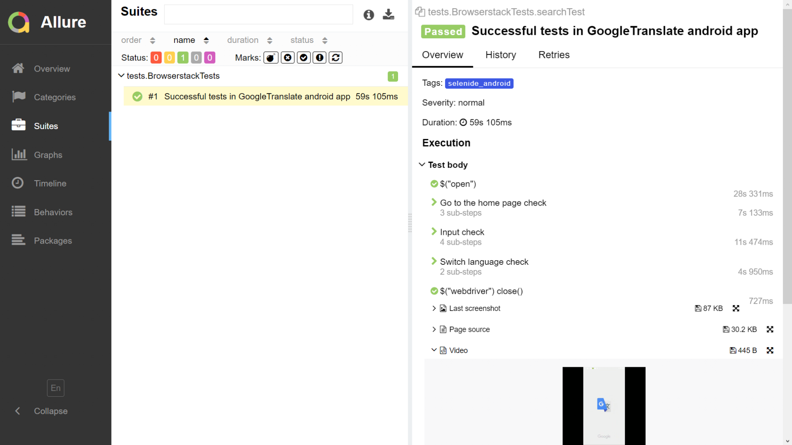
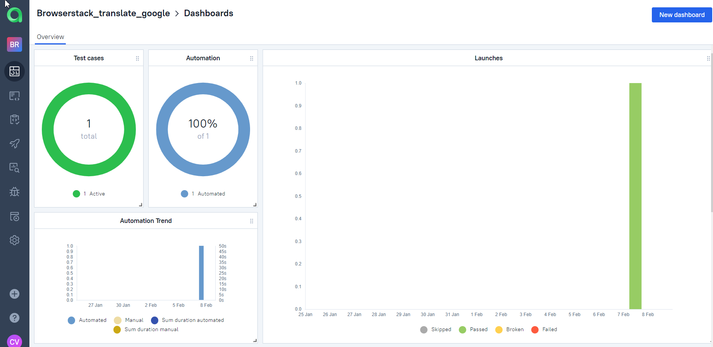

## Automated App testing (Android) for https://translate.google.com/

#### *Quick project example with infrastructure: Selenide UI tests with Allure report, remote run on Browserstack and push notifications to Telegram*

### Technology Stack


### Еxamples of UI tests are <a target="_blank" href="https://github.com/Konyaz/insales_dip/">here</a> :green_circle:
### Еxamples of Api automation tests are <a target="_blank" href="https://github.com/Konyaz/rest_assured_dip/">here</a> :green_circle:


## Run locally

If you've downloaded these tests to your computer, run them with the following command:
```bash
gradle clean test
```


### Allure report





### Allure TestOps

:bar_chart: Dashboards




:robot: Automated tests can be imported by Allure TestOps as test cases. 


### Video :tv:


### Jenkins
Click <a target="_blank" href="https://jenkins.autotests.cloud/job/Browserstack_dip/">here</a> to run the tests.


### Telegram


